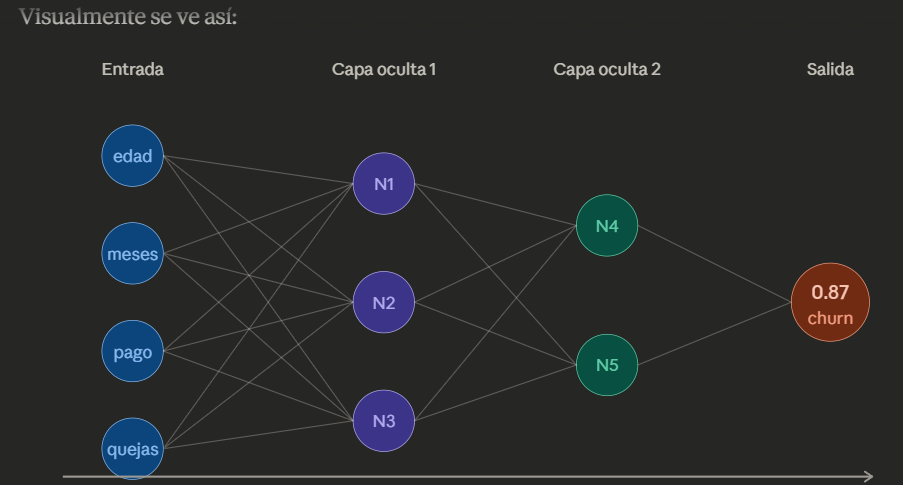
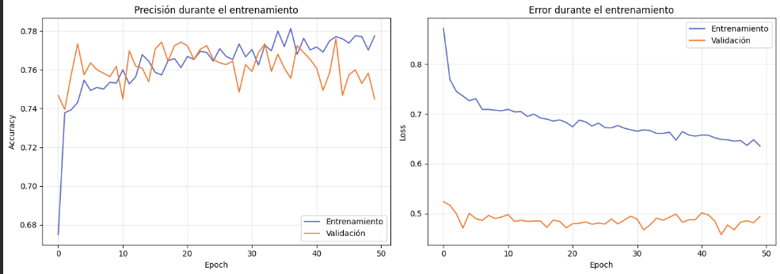
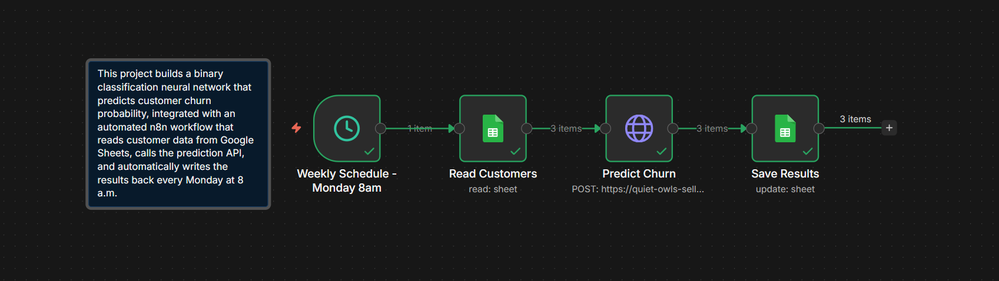
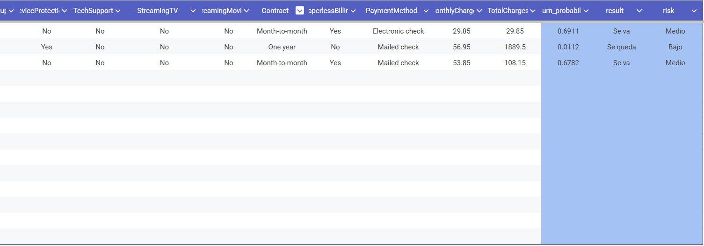
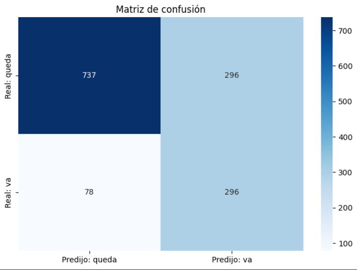

# 🧠 Churn Predictor — Neural Network + n8n Automation

> Predicts which customers are likely to leave, using a neural network trained on real data, automated end-to-end with n8n.

---

## 📌 Overview

This project builds a **binary classification neural network** that predicts customer churn probability, integrated with an **automated n8n workflow** that reads customer data from Google Sheets, calls the prediction API, and writes results back automatically every Monday at 8am.

**Key results:**
- 79% recall on churn detection (catches 8 out of 10 customers who will leave)
- Full automation: zero manual intervention after setup
- Real-time predictions via REST API

---

## 📊 How the Neural Network Works

The network takes 30 customer features as input, passes them through 2 hidden layers, and outputs a churn probability between 0 and 1.



```
Input Layer (30 features)
        ↓
Hidden Layer 1 — 64 neurons, ReLU activation
        ↓
Dropout (30%) — prevents memorization
        ↓
Hidden Layer 2 — 32 neurons, ReLU activation
        ↓
Dropout (30%)
        ↓
Output Layer — 1 neuron, Sigmoid activation → probability 0 to 1
```

**Training curves:**



---

## 🔄 n8n Automation Flow

The workflow runs automatically every Monday at 8am:



**Step by step:**

1. **Weekly Schedule** — triggers every Monday at 8am
2. **Read Customers** — pulls customer data from Google Sheets
3. **Predict Churn** — sends each customer to the Flask API and receives the prediction
4. **Save Results** — writes churn probability, result and risk level back to the sheet

---

## 📈 Results in Google Sheets



**Example predictions:**

| Contract | Tenure | Monthly Charges | Churn Probability | Result | Risk |
|----------|--------|-----------------|-------------------|--------|------|
| Month-to-month | 1 month | $29.85 | 0.6911 | Leaves | Medium |
| One year | 34 months | $56.95 | 0.0112 | Stays | Low |
| Month-to-month | 2 months | $53.85 | 0.6782 | Leaves | Medium |

---

## 🧪 Model Performance



| Metric | Stays | Leaves |
|--------|-------|--------|
| Precision | 90% | 50% |
| Recall | 71% | **79%** |
| F1-score | 80% | 61% |

> **79% recall on churn** means the model catches 8 out of 10 customers who will leave — giving the retention team time to act before it's too late.

---

## 🛠️ Tech Stack

| Layer | Technology |
|-------|-----------|
| Neural Network | TensorFlow / Keras |
| Data Processing | Pandas, Scikit-learn |
| API | Flask + localtunnel |
| Automation | n8n |
| Storage | Google Sheets |
| Environment | Google Colab |

---

## 📁 Project Structure

```
churn-predictor-neural-network/
│
├── churn_predictor.ipynb     # Main notebook (training + API)
├── churn_model.keras         # Trained model
├── scaler.pkl                # Data normalizer
├── feature_names.pkl         # Column names
├── screenshots/              # README images
│   ├── architecture.png      # Neural network diagram
│   ├── training_curves.png   # Training curves
│   ├── n8n_workflow.png      # n8n canvas
│   ├── sheets_results.png    # Google Sheets results
│   └── confusion_matrix.png  # Confusion matrix
└── README.md                 # This file
```

---

## 🚀 How to Run

**1. Clone the repository**
```bash
git clone https://github.com/YOUR_USERNAME/churn-predictor-neural-network
```

**2. Open the notebook in Google Colab**
- Upload `churn_predictor.ipynb` to Colab
- Run all cells in order

**3. Start the API**
- The last cells in the notebook start the Flask server and create a public URL via localtunnel

**4. Connect n8n**
- Import the workflow
- Update the API URL with your localtunnel URL
- Activate the workflow

---

## 📚 What I Learned

- How binary classification neural networks work (input → hidden layers → sigmoid output)
- Data preprocessing: encoding categorical variables, normalizing numerical features
- Handling imbalanced datasets with class weights
- Building and deploying a REST API with Flask
- End-to-end automation with n8n connecting external APIs to Google Sheets

---

## 👩‍💻 Author

Made with 💜 as part of my AI & Automation portfolio.

> *"Every customer that leaves costs more than keeping them. This model gives retention teams a head start."*
